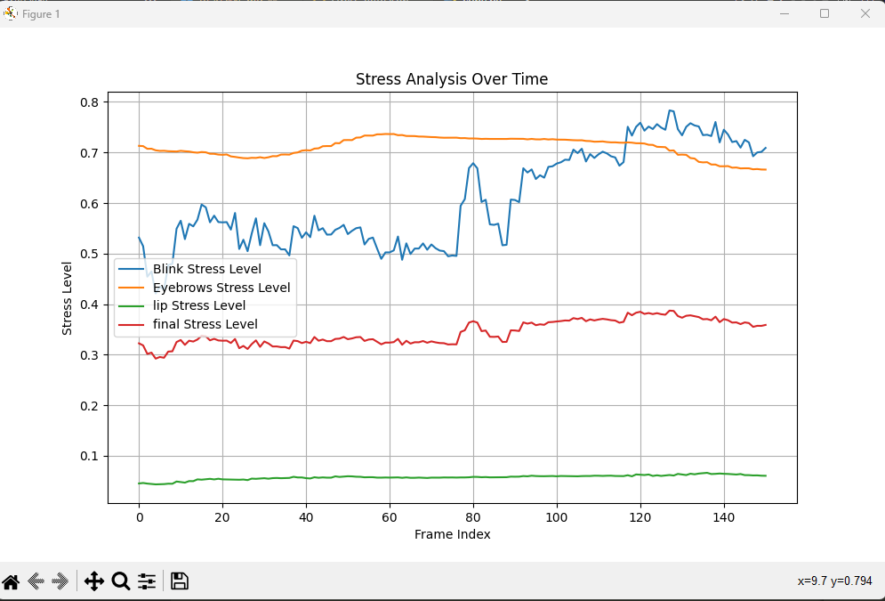

# Documentation 

I. **Introduction** 

This script utilizes the MediaPipe library for face landmark detection to analyze stress-related features in a video. It calculates stress levels based on factors such as blink patterns, eyebrow movements, and lip movements. 

2. **Installation** 

To install the required Python libraries for this script, you can use the following command in your terminal or command prompt: 

```python
    pip install -r requirements.txt
```

3. **Usage** 

To use the script, you can replace the "video.mp4" with the path to your desired input video.  

```python
input_video_path = "video.mp4"
```

The stress data will be saved in the “output/stress\_data.json" file. Adjustments to the stress calculation logic or output format can be made as needed. 

```python
python main.py
```

##  **Code Overview** 
1. **Reference** 

All the landmarks indexes are brought for the image provided by MediaPipe. 

[https://storage.googleapis.com/mediapipe- assets/documentation/mediapipe_face_landmark_fullsize.png ](https://storage.googleapis.com/mediapipe-assets/documentation/mediapipe_face_landmark_fullsize.png)

2. **Imported Libraries** 

```python
import cv2
import mediapipe as mp
import json
```
**cv2 (OpenCV):** Handles video input and facilitates advanced image processing. 

**Mediapipe**: Provides powerful face detection with predefined landmark recognition models. 

**JSON:** Utilized for storing processed stress data in JSON format 

3. **MediaPipe Model Initialization** 
```python
# Initialize MediaPipe Face and Hand models
mp_face_mesh = mp.solutions.face_mesh.FaceMesh()
```

**mp\_face\_mesh:** Initializes the MediaPipe Face Mesh model for precise facial landmark detection. 

4. **Eye Aspect Ratio (EAR) Calculation:** 

```python
# Function to calculate eye aspect ratio (EAR)
def eye_aspect_ratio(eye_landmarks):
    # Define the indexes of the eye landmarks
    left_eye_indexes = [33, 159, 145, 155]
    right_eye_indexes = [463, 386, 374, 263]
    # Extract the coordinates of the left and right eyes from the landmarks
    left_eye_coords = [(eye_landmarks[idx].x, eye_landmarks[idx].y) for idx in left_eye_indexes]
    right_eye_coords = [(eye_landmarks[idx].x, eye_landmarks[idx].y) for idx in right_eye_indexes]

    # Calculate the vertical distances between the eye landmarks
    left_eye_ver_dist = abs(left_eye_coords[1][1] - left_eye_coords[2][1])
    right_eye_ver_dist = abs(right_eye_coords[1][1] - right_eye_coords[2][1])

    # Calculate the horizontal distance between the outer and inner eye corners
    left_eye_hor_dist = abs(left_eye_coords[0][0] - left_eye_coords[3][0])
    right_eye_hor_dist = abs(right_eye_coords[0][0] - right_eye_coords[3][0])

    # Calculate the eye aspect ratio
    ear_left = left_eye_ver_dist / left_eye_hor_dist
    ear_right = right_eye_ver_dist / right_eye_hor_dist

    # Calculate the average eye aspect ratio
    ear_avg = (ear_left + ear_right) / 2.0
    
    return ear_avg
```

**eye\_aspect\_ratio:** Computing the Eye Aspect Ratio (EAR) is crucial for blink detection, utilizing specific landmarks for each eye. It calculates the distance between the top and bottom of the eye for each one. 

5. **Blink Stress Calculation:** 

```python
# Function to calculate blink stress
def calculate_blink_stress(face_landmarks):
    # Extract eye landmarks from face landmarks
    if not face_landmarks: 
        print("no face blink landmarks")
        return 0
    eye_landmarks = face_landmarks[0].landmark

    # Calculate eye aspect ratio
    Eye_AR = eye_aspect_ratio(eye_landmarks)

    if  0 <= Eye_AR <= 1:
        return 1 - Eye_AR
    return 0
```

**calculate\_blink\_stress:** Determines blink stress based on the EAR. 

6. **Eyebrow Displacement and Stress Calculation:** 

```python
# Function to calculate average vertical displacement of eyebrow landmarks
def calculate_eyebrow_displacement(eyebrow_landmarks):
    # Extract y-coordinates of eyebrow landmarks
    y_coords = [landmark.x for landmark in eyebrow_landmarks]

    # Calculate average vertical displacement
    avg_displacement = sum(y_coords) / len(y_coords)

    return avg_displacement

# Function to calculate eyebrow stress
def calculate_eyebrow_stress(face_landmarks):
    # Define the indexes of the facial landmarks for left and right eyebrows
    left_eyebrow_indexes = [70, 63, 105, 66, 107, 46, 53, 65, 55]
    right_eyebrow_indexes = [300, 293, 334, 296, 336, 275, 283, 282, 295, 285]

    if not face_landmarks: return 0
    # Extract the coordinates of the left and right eyebrows from facial landmarks
    left_eyebrow_landmarks = [face_landmarks[0].landmark[idx] for idx in left_eyebrow_indexes]
    right_eyebrow_landmarks = [face_landmarks[0].landmark[idx] for idx in right_eyebrow_indexes]

    # Calculate average vertical displacement for left and right eyebrows
    avg_displacement_left = calculate_eyebrow_displacement(left_eyebrow_landmarks)
    avg_displacement_right = calculate_eyebrow_displacement(right_eyebrow_landmarks)

    # Calculate the overall average eyebrow displacement
    avg_displacement = (avg_displacement_left + avg_displacement_right) / 2.0


    return 1 - avg_displacement if avg_displacement > 0 else 0
```

**calculate\_eyebrow\_stress:** Measures eyebrow displacement for stress assessment. 

**calculate\_eyebrow\_displacement:** Computes the average vertical displacement of both eyebrows landmarks. 

7. **Lip Movement Stress Calculation:** 

```python
def calculate_lip_stress(face_landmarks):
    if not face_landmarks: return 0
    # Extract lip landmarks from face landmarks
    lip_landmarks = face_landmarks[0].landmark
    # Define the indexes of the lip landmarks
    upper_lip_indexes = [0, 11, 12, 13, 270, 40, 185]
    lower_lip_indexes = [14, 16, 17, 320, 180, 375]

    # Extract the coordinates of the upper and lower lips from the landmarks
    upper_lip_coords = [(lip_landmarks[idx].x, lip_landmarks[idx].y) for idx in upper_lip_indexes]
    lower_lip_coords = [(lip_landmarks[idx].x, lip_landmarks[idx].y) for idx in lower_lip_indexes]

    # Calculate the vertical distance between the upper and lower lips
    lip_ver_dist = abs(upper_lip_coords[6][0] - lower_lip_coords[5][0])
    # print(lip_ver_dist)
    return lip_ver_dist
```

**calculate\_lip\_stress:** calculates the stress related to the lip movement by measuring the vertical distance between upper and lower lip landmarks. 

8. **Stress Aggregation:** 

```python
# Function to calculate stress level from facial features
def calculate_stress(face_landmarks):
    # Simplified stress calculation based on blink, eyebrow, and lip movement
    blink_stress = calculate_blink_stress(face_landmarks)  # blink detection logic
    eyebrow_stress = calculate_eyebrow_stress(face_landmarks)  # eyebrow movement detection logic
    lip_stress = calculate_lip_stress(face_landmarks) # lip movement detection logic
   
    # Aggregation of stress factors
    final_stress = 0.25*blink_stress + 0.25*eyebrow_stress + 0.25*lip_stress

    return blink_stress, eyebrow_stress, lip_stress, final_stress
```

**calculate\_stress:** Combines the factors related to blink, eyebrow, and lip movement to derive an overall stress level. 

9. **Video Processing and Stress Data Generation:** 

```python
# Function to process video and generate stress data
def process_video(input_video_path):
    cap = cv2.VideoCapture(input_video_path)
    frame_rate = cap.get(cv2.CAP_PROP_FPS)

    stress_data = {'frames': []}
    while cap.isOpened():
        ret, frame = cap.read()
        if not ret:
            break

        # Run face and hand detection on each frame
        results_face = mp_face_mesh.process(cv2.cvtColor(frame, cv2.COLOR_BGR2RGB))
        # results_hand = mp_hand_mesh.process(frame)

        # Extract landmarks for face and hand
        face_landmarks = results_face.multi_face_landmarks
        # hand_landmarks = results_hand.multi_hand_landmarks

        # Calculate stress level for the current frame
        blink_stress, eyebrow_stress, lip_stress, final_stress = calculate_stress(face_landmarks)

        # Append timestamp and stress value to the data
        stress_data['frames'].append({
            'frame': int(cap.get(cv2.CAP_PROP_POS_FRAMES)),
            'blink_stress': blink_stress,
            'eyebrow_stress': eyebrow_stress,
            'lip_stress': lip_stress,
            'final_stress': final_stress
        })
    cap.release()

    return stress_data
```

**process\_video:** Processes each frame of a video, utilizing the defined stress calculation components. 

The resulting data includes frame number, blink stress, eyebrow stress, lip stress, and final stress, stored in a dictionary. 

```python
    # Save stress data as JSON
    with open("output/stress_data.json", "w") as json_file:
        json.dump(output_data, json_file)
```

Then dumping the resulting data in a JSON file. 

```JSON
{
    "frame": 1, 
    "blink_stress": 0.5315998417277169, 
    "eyebrow_stress": 0.7130867063999176, 
    "lip_stress": 0.045376360416412354, 
    "final_stress": 0.32251572713601173
 }
```
Now that the data has been successfully stored in a JSON file, I’ll make it more visually appealing using Matplotlib.



To make this happen, we’ll first extract the data for various stress features and then plot it on a graph. This way we can visualize the stress related information more effectively.

## ToDo
`* Implement hand detection`

`* Improve the detection accuracy` 

`* Implement a different stress detection using TensorFlow` 
